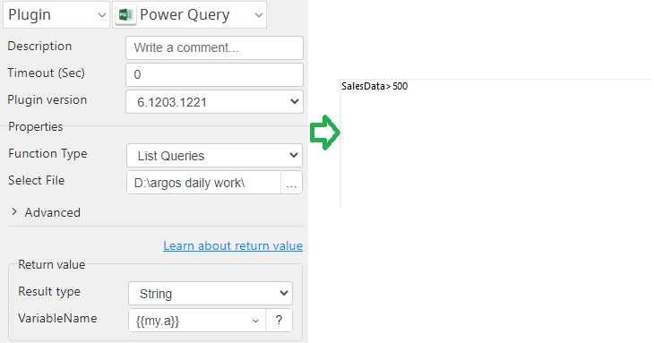
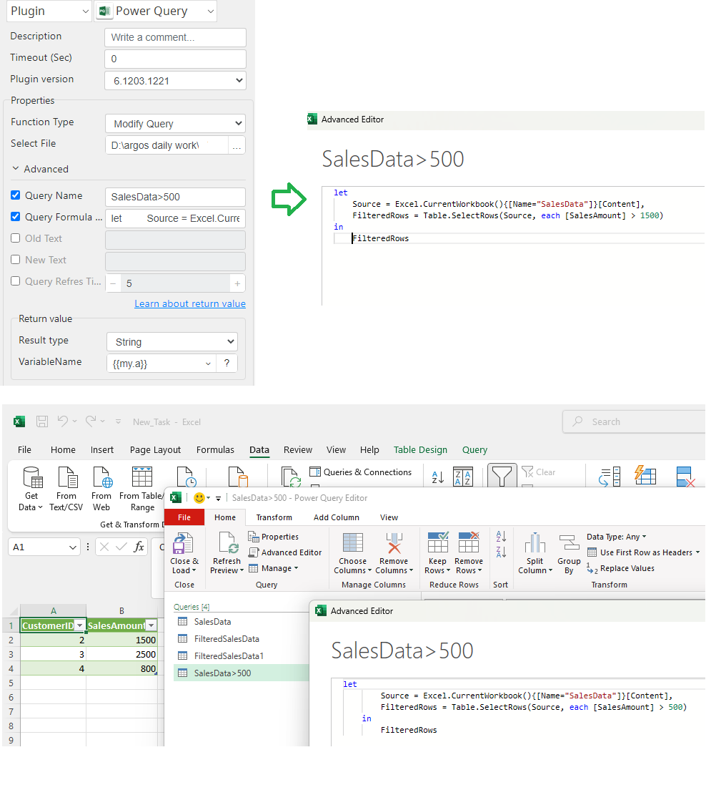
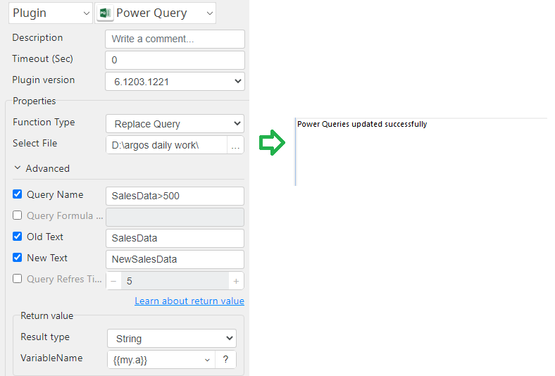
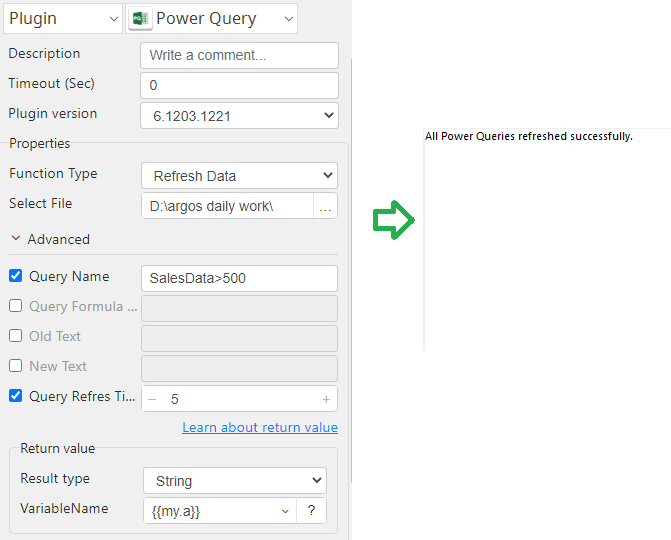

# Power Query

***Power Query with this plug-in can List, Modify, Replace and Refresh 
Power Query Formula.***

## Power Query
| Item         |           Value           |
|--------------|:-------------------------:|
| Icon         |   |
| Display Name |      **Power Query**      |

### Arun Kumar (arunk@argos-labs.com)

Arun Kumar
* [email](mailto:arunk@argos-labs.com) 
 
## Version Control 
* [6.1203.1221(setup.yaml)
* Release Date: `December 03, 2024`

## Input (Required)
| Function Type  | Parameters         | Output            |
|----------------|--------------------|-------------------|
| List Queries   | Select File        | queries name list |
| Modify Query   | Select File        | success message   |
|                | Query Name         |                   |
|                | Query Formula Text |                   |
| Replace Query  | Select File        | success message   |
|                | Query Name         |                   |
|                | Old Text           |                   |
|                | New Text           |                   |
| Refresh Data   | Select File        | success message   |
|                | Query Refres Time  |                   |

## Return Value

### Normal Case
Description of the output result

## Return Code
| Code    | Meaning          |
|---------|------------------|
| 0       | Success          |
| 1       | Exceptional case |
| 98      | error            |

## Output Format
You may choose one of 3 output formats below,

<ul>
  <li>String (default)</li>
  <li>CSV</li>
  <li>File</li>
</ul>  

## Parameter setting examples (diagrams)

## Operations

### List Queries:

### Modify Query:

### Replace Query:

### Refresh Data:

